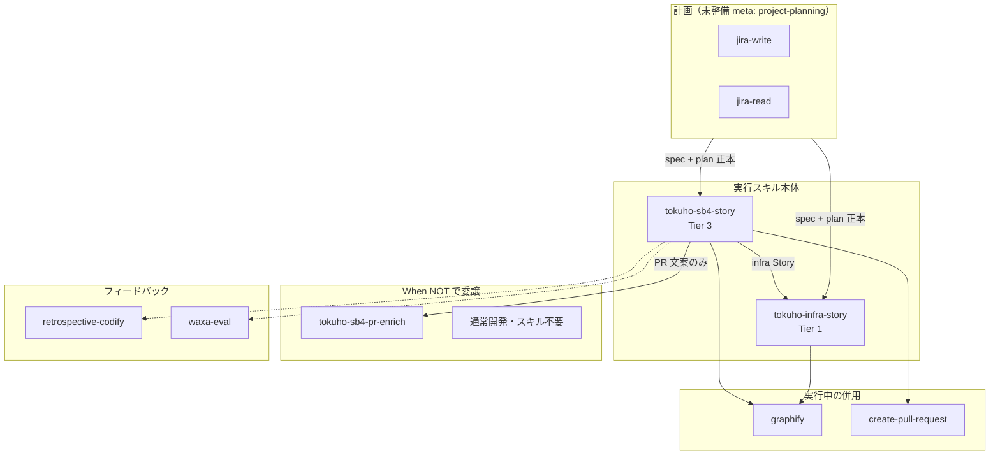

## tl;dr

- コーディングエージェントに再現性を持たせるには、**What / How / Why / Must / When NOT** の 5 層を分ける
- 計画は **spec + plan** の 2 本、スキルは **`project-planning`（書く）と `story-execution`（読んで実行）** に分離する
- `story-execution` はプロジェクトごとの雛形ではなく **meta エンジン 1 本**。プロジェクト差分は主に `projects/<id>.env`
- 厚い実行スキル（Tier 3）は **失敗のたびに Must を硬化**した結果。Tier 1 から始め、同じ失敗が 2 回出たら script 化する
- 本稿は大規模移行プロジェクトで実際に回した運用を抽象化したメモ

## はじめに

Cursor などのコーディングエージェントに「計画どおりゴールまで連れて行ってほしい」と依頼するとき、プロンプトだけでは再現性が足りない。自分たちの大規模移行では、実行用スキルと `doc/<project>/` 配下のドキュメント群が、計画・実行・記録・検証を分離した**オペレーティングシステム**として機能している。

本稿はその実践を抽象化し、今後のプロジェクトでも再利用できる枠組みとして整理した。

## 1. 何が効いていたか — 5 層

| 層 | 役割 | 具体例 |
|---|---|---|
| **What** | ゴールとタスクの一次ソース | `jira-ticket-plan.md` の PROJ-XX、完了条件 |
| **How** | 設計と実装 | `spec.md`、コード変更 |
| **Why** | 判断の経緯 | `work-report.md` の「なぜそうしたか」 |
| **Must** | LLM が忘れやすいことの機械化 | `push_story_branch.sh`、pre-push hook |
| **When NOT** | スコープ外の委譲 | 別ドメイン・別用途のスキルへ（[付録 A](#付録-aスキル一覧実装済み2026-03-時点) 参照） |

計画があるなら、記録とゲートまでセットにするのがこの型の強み。

## 2. 計画ドキュメント 2 本の棲み分け

### spec と plan

| | spec（`spec.md`） | plan（`jira-ticket-plan.md`） |
|---|---|---|
| 問い | 何を・なぜ・どうやるか | 誰が・いつ・どのチケットで |
| 軸 | 技術フェーズ | Jira Story（PROJ-XX） |
| 相互参照 | 末尾で plan へ | 冒頭で spec へ |

**plan → spec は中身を読む。spec → plan はチケットを探す。**

技術 Phase と Story は 1:1 ではない。plan は並行作業単位、spec は技術の横断マップ。

### spec のファイル名 — memo 段階と正本で役割が違う

正本では `spec.md` に統一するが、**memo 段階のファイル名はプロジェクトの目的をそのまま表す**ことが多い。

例として、メジャーバージョン移行で「新バージョン用 dev 環境を構築し、旧バージョン dev と並行開発を続ける」という目的があった場合、memo では次のような名前になりうる。

```text
memo-<技術>-<環境目的>.md
  例: memo-<新FW>-dev-parallel.md   # 「dev 並走」が目的であることを示す
```

`parallel`（並走）は、単なるバージョンアップ手順書ではなく、**旧環境を止めずに新環境を横に立てる**設計 — FQDN 分離、ブランチ戦略、CI/CD 分岐、セッション namespace 分離など — を spec に書く、という意図が名前に載る。

| 段階 | ファイル名の考え方 |
|---|---|
| memo（下書き） | **目的・制約が一目でわかる**名前（並走、移行、監視横断化 など） |
| 正本（`doc/<project>/`） | **`spec.md` に統一** — パスでプロジェクトは区別できるため |
| plan | こちらも正本は **`jira-ticket-plan.md` に統一** |

memo 名は探索期のラベル、正本名は実行エンジンが読む安定した入口、という棲み分け。

### memo → 正本の流れ

```text
探索（チャット）→ spec memo → plan memo → Jira 起票 → doc/<project>/ へ昇格 → 実行 doc 追加
```

典型的なタイムライン:

| 段階 | 出来事 |
|---|---|
| 第 1 週 | チャットで探索・方針合意 → spec memo 初版 |
| 第 2 週 | plan memo 初版 → Jira 起票 |
| 第 2 週末 | `doc/<project>/` へ正本化、integration ブランチ作成 |

`~/memo-*.md` はスナップショット。以降の正本はリポジトリ内 `doc/<project>/` のみを更新する。

### 実行フェーズで増える doc

```text
spec / plan（計画）
issue-pr-mapping（問題索引）
reports/PROJ-xxxx/work-report（判断記録）
```

## 3. Jira との 3 段 ID

| ID | 例 | 記載先 |
|---|---|---|
| プロジェクトコード | MIGR, INFR | plan 見出し |
| Story 連番 | MIGR-07 | plan セクション |
| Jira キー | PROJ-1315 | 対応表、ブランチ |
| Task 連番 | 7-3 | plan のみ |

## 4. スキル設計 — 計画と実行は別

| | `project-planning` | `story-execution` |
|---|---|---|
| 層 | What（+ spec としての How 設計） | How 実装 + Why + Must + When NOT |
| いつ | プロジェクト開始時 | Story 着手〜完了のたび |
| 関係 | **書く側** | **読む側** |

計画スキルは 1 本で全プロジェクト共用しやすい。実行は **meta 1 本 + `.env`** に寄せる。

### story-execution は雛形ではない

```text
story-execution/          # meta（1 本だけ育てる）
├── SKILL.md
├── projects/
│   ├── registry.yaml     # プロジェクト選択
│   ├── _template.env     # 雛形（ここだけコピー）
│   └── app-migration.env
└── scripts/              # 汎用
```

新プロジェクトで本体を複製するのではなく、**`_template.env` をコピー**（Tier 1）。

## 5. 3 段階モデル

**meta は常に存在。Tier はプロジェクト側に何を足すか。**

| Tier | 足すもの | 例 |
|---|---|---|
| 0 | なし | 単発 Story → planning のみ |
| 1 | `doc/` + `.env` | インフラ横断改善 |
| 2 | verify script 1〜2 本 | ビルド / terraform plan |
| 3 | plugin / wrapper | 大規模移行（30+ scripts） |

Tier 3 の厚さは初回設計ではなく、**CI が formatter 未適用で落ちた**など、失敗のたびに Must が硬化した結果。

## 6. ルーティング — どの doc を読むか

### ① プロジェクト選択（registry）

```yaml
app-migration:
  env: app-migration.env
  jira_parent: PROJ-1309
```

Jira キー → registry → `.env` を load。

### ② ドキュメントパス（.env）

```bash
PLAN_REL=doc/app-migration/jira-ticket-plan.md
SPEC_REL=doc/app-migration/spec.md
```

### ③ Story → spec 章（plan が持つ）

```markdown
## MIGR-07 (PROJ-1315): ...
**spec 参照:** Phase A
```

registry はプロジェクト入口、plan は Story 単位の参照。二重管理しない。

## 7. フィードバックループ（標準装備にしたいもの）

| 段階 | 内容 |
|---|---|
| 0 | 手動 1 本 → 迷いをメモ |
| 1 | ワークフローのみ |
| 2 | **同じ失敗 2 回 → script 化** |
| 3 | スキル eval（waxa 等） |
| 4 | セッション後の教訓固定（retrospective-codify） |
| 5 | 遡及適用（スキル改善時に既存 doc を放置しない） |

層ごとの出口:

- **Must** が主戦場（verify / hook）
- **Why** → work-report
- 教訓 → `reference.md` 変更履歴に 1 行

## 8. 実行フロー（6 フェーズ）

```text
1. Story 特定（plan + Jira Blocks）
2. 環境準備（ブランチ、.env）
3. レポート初期化（完了条件を plan から転記）
4. タスク実行 + 記録（Why）
5. 索引・計画更新（mapping、plan 状態行）
6. 完了確認（Must ゲート → push/PR）
```

## 9. 新規取り組みの判断フロー

```text
単一 Story / 短期？     → Tier 0（planning のみ）
Epic / 複数 Story？     → Tier 1（.env）
専用ゲート必要？        → Tier 2（verify）
doc 分離・複雑 Jira？   → Tier 3（plugin）
```

## まとめ

1. **5 層**で責務を分ける
2. **計画 2 本**（spec + plan）、**スキル 2 本**（planning + execution）
3. **story-execution は meta**。プロジェクト差分は `.env`
4. **ルーティング**は registry + `.env` + plan
5. **育て方はフィードバックが標準** — 同じ失敗 2 回で Must 化

計画で地図を描き、実行エンジンが地図を見て歩き、失敗のたびにゲートを増やす — この循環を仕組みにするのが、エージェントにゴールまで連れて行かせるための実践的な答え。

---

## 付録 A: スキル一覧（実装済み・2026-03 時点）

本稿ではフレームワークを汎用化して述べたが、**実際に運用している Cursor スキル名**をここに残す。いずれも `~/.cursor/skills/` 配下。

### A-1. 実行スキル本体（Story 単位でゴールまで）

| スキル名 | Tier | 主なリポジトリ | 計画 doc | 役割 |
|---|---|---|---|---|
| **`tokuho-sb4-story`** | 3 | アプリ（server） | `doc/move-to-sb4/` | メジャーバージョン**並走 dev 移行**の Story 実行。doc ブランチ分離・PR ゲート・遡及更新まで含む**厚い実行スキル** |
| **`tokuho-infra-story`** | 1 | インフラ（infra） | `doc/<project>/`（例: `lambda-monitoring`） | 上記を抽象化。`projects/<id>.env` でプロジェクト差分を吸収 |

将来の **`story-execution` meta** は、上記 2 本の共通部分を抽出し、Tier 3 相当は plugin に逃がす想定（**現時点では未作成**）。

### A-2. `tokuho-sb4-story` の When NOT — 委譲先一覧

アプリ移行 Story スキルが**意図的に起動しない**状況と、代わりに使うスキル（スキル定義原文より）。

| 状況 | 委譲先 |
|---|---|
| インフラリポジトリの Story（Terraform 等） | **`tokuho-infra-story`** |
| `develop` / `main` ベースの通常開発・単発バグ修正 | **スキル不要**（Story フローは使わない） |
| PR 本文・行コメントの**提案だけ**（実装・push はしない） | **`tokuho-sb4-pr-enrich`** |
| 対象 Epic 外のチケット | **該当プロジェクトの実行スキル**、または通常開発 |
| スキル自身の品質監査（waxa / description）のみ | **`waxa-eval`** / **`optimizing-descriptions`** |

### A-3. 実行中に併用するスキル（本体ではないが Story フローに組み込まれる）

| スキル名 | 層 | いつ使うか |
|---|---|---|
| **`graphify`** | How（探索） | コード変更前の `query`、変更後の `update`。両実行スキルから参照 |
| **`jira-read`** | What（読取） | Story 特定、`Blocks` 確認、`get_issue.sh` |
| **`jira-write`** | What（書込） | バックログ登録時の Jira コメント、調査結果の追記 |
| **`create-pull-request`** | 完了後 | Story ブランチの PR 作成（テンプレ適用） |
| **`tokuho-sb4-pr-enrich`** | 完了後（任意） | 関心事の多い PR の description / 行コメント**案**（GitHub 自動投稿はしない） |

### A-4. 計画フェーズ用（実行スキルとは別）

| スキル名 | 状態 | 役割 |
|---|---|---|
| **`project-planning`** | **未作成**（本稿で設計） | spec / plan memo、Jira 起票、memo → 正本昇格 |
| **`jira-write`** | 実装済 | 計画時の Epic / Story 一括起票にも使用（SB4 起票時の実績あり） |
| **`jira-read`** | 実装済 | 計画前の既存チケット調査 |

### A-5. フィードバックループ用メタスキル（実行のたびではない）

| スキル名 | 役割 |
|---|---|
| **`retrospective-codify`** | セッション後に「最初の失敗 ↔ 最終解」をスキル / lint / ルールに固定 |
| **`waxa-eval`** | スキル文言の empirical eval、収束判定 |
| **`empirical-prompt-tuning`** | waxa の方法論（バイアスフリー executor + 二面評価） |
| **`optimizing-descriptions`** | スキル `description` の監査・改善 |

### A-6. スキル間の関係（概要）



### A-7. インスタンス対応表（実行スキル ↔ プロジェクト）

| 実行スキル | project id（.env） | プロジェクトコード | 親 Epic（例） |
|---|---|---|---|
| `tokuho-sb4-story` | （スキル内直書き） | SB4-XX | アプリ移行 Epic |
| `tokuho-infra-story` | `lambda-monitoring` | LMON-XX | 保守運用 Epic |

新規プロジェクト追加時は、**Tier 1 なら `tokuho-infra-story` 型**（`.env` 1 本）、**Tier 3 なら `tokuho-sb4-story` 型**（専用 plugin）を選ぶ、というのが現時点の実運用。

