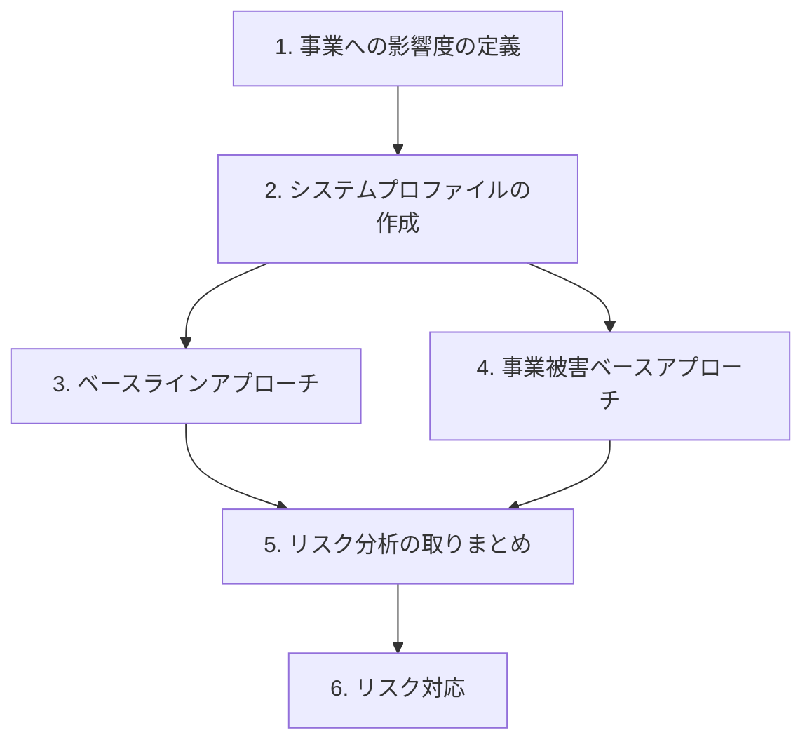
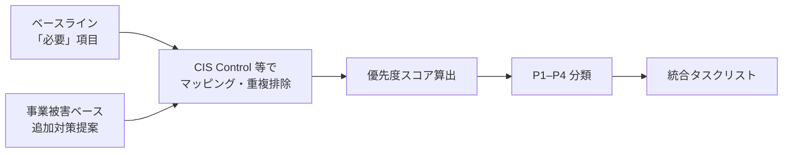

## はじめに

セキュリティリスク分析は、大企業や行政向けの話に聞こえがちです。専任のセキュリティ担当がいない小規模チームでも、**再現可能なプロセス**として回せば、対策の優先順位を説明可能な形で整理できます。

本記事では、B2B SaaS（クラウドバックエンド＋Webフロント＋現場端末＋外部SaaS連携）を対象に、政府系セキュリティ分析ガイドラインを参考に実施したリスク分析の**手順だけ**を、固有名詞を抽象化して紹介します。

対象読者:

- セキュリティ専任者がおらず、エンジニアリングチームでリスク整理を始めたい方
- ペネトレーションテスト前に「何を守るべきか」を言語化したい方
- 対策タスクの優先順位づけに困っている方

:::message
本記事は特定プロダクトの分析結果そのものではなく、**分析プロセスの一般化**を目的としています。フレームワーク名（CIS Controls 等）やガイドラインへのリンクは、再現性のためにそのまま残しています。
:::

## なぜ「二つのアプローチ」を組み合わせるのか

リスク分析には大きく分けて次のような手法があります。

| 手法 | 長所 | 短所 |
| --- | --- | --- |
| **ベースラインアプローチ** | 既存基準に沿ったチェックで工数が抑えられる | 自社固有の事業被害まで踏み込みにくい |
| **事業被害ベースアプローチ** | 実際の被害シナリオから逆算できる | 攻撃ツリーを網羅すると工数が爆発する |
| **詳細リスク分析（資産ベース等）** | 精度が高い | 初回コストが大きく、専門家が必要 |

小規模チーム向けの現実解として、**ベースラインを軸に、事業被害ベースで穴を埋める**組み合わせが有効です。政府系ガイドラインでも同様の構成が推奨されています。

この組み合わせが満たす3つの要件:

1. **網羅性** — 想定される脅威と対策を一通り把握できる
2. **レビュー可能性** — 技術・事業・評価の3視点で相互確認できる
3. **現実的な工数** — 限られた人員でも完走できる

:::message alert
事業被害ベースでは「すべての攻撃ツリーを洗い出す」のではなく、**トップリスク（最も避けたい事業被害）** にフォーカスします。ここを外すと、分析が終わりません。
:::

## 全体像：6段階プロセス



各ステップの成果物と担当の目安:

| ステップ | 成果物 | 主担当 |
| --- | --- | --- |
| 1 | 事業リスク×影響度の定義表 | ビジネス / リスクオーナー |
| 2 | システムプロファイル | システム管理者 |
| 3 | ベースライン適合状況表 | セキュリティ評価者 |
| 4 | 攻撃シナリオ表・対策タスクリスト | 評価者＋システム管理者 |
| 5 | 統合タスクリスト（優先度付き） | 全関係者でレビュー |
| 6 | リスクレジスタ・実施計画 | リスクオーナー |

評価者は1名でも回りますが、**2名以上**だと判定の偏りを抑えやすいです。

---

## Step 1: 事業への影響度の定義

後続のすべての工程で使う**共通物差し**を先に作ります。

### 事業リスクの種類（例）

ガイドラインでは、次のような事業リスクの類型が定義されています（文言は要約）。

| # | 事業リスクの種類 |
| --- | --- |
| 1 | 利用者への不便・苦痛、または組織の信頼失墜 |
| 2 | 金銭的被害・賠償責任など財務上の影響 |
| 3 | 組織活動や公共の利益への影響 |
| 4 | 個人情報など機微情報の漏洩 |
| 5 | 法令違反 |

### 影響度（高位 / 中位 / 低位 / 非該当）

| 影響度 | イメージ |
| --- | --- |
| **高位** | 致命的・壊滅的。元の状態に戻せない |
| **中位** | 重大だが、復旧可能 |
| **低位** | 限定的・短期間 |
| **非該当** | 影響なし |

### 実務上のポイント

- 「個人情報漏洩＝必ず高位」と決め打ちしない。**自社のデータ分類とサービス特性**で判断する
- 各リスク類型について「最悪の事象」を1文で書いておくと、Step 4 が楽になる
- この表は**一度きりで終わりにしない**。四半期〜年次で見直す

---

## Step 2: システムプロファイルの作成

システムプロファイルは、リスク分析の**根拠となる前提**を文章化したものです。設計書の写しではなく、「なぜこの保証レベルなのか」を説明するための資料です。

### 記載項目（最小セット）

**事業の概要**

- 事業目的
- 6類型の事業リスクそれぞれの影響度
- 導出した**保証レベル**（後述）

**システムの意図する使用**

- 誰が（管理者 / 一般ユーザー / 現場オペレータ等）
- どこから（Webブラウザ / 専用端末 / API）
- どのネットワーク経路でアクセスするか

**システムの特性**

- 情報資産（保存データ、ログ、認証情報）
- 認証・認可モデル（ロール、テナント分離）
- アーキテクチャ（クラウド / コンテナ / エッジ端末 / 外部SaaS）
- 主要なデータフロー（任意だが、トップリスク分析には有用）

### 保証レベルの導出

NIST SP 800-63B の Authenticator Assurance Level（AAL）を参考に、認証強度の目標を置く例:

| レベル | 要件のイメージ |
| --- | --- |
| AAL1 | 単要素認証 |
| AAL2 | 多要素認証（ソフトウェアベース可） |
| AAL3 | 多要素認証＋ハードウェアトークン等 |

プロファイルでは **「目標の AAL」** と **「現状の AAL」** の両方を書くと、ギャップが対策タスクに直結します。

### 粒度のコントロール

- 完璧な設計書を目指さない。**レビューに必要な粒度**で十分
- 未確定の仕様は「TBD」と明記し、バックログで追跡する（アジャイル向け）
- 作成自体が目的化しない。分析の前提を固定することが目的

---

## Step 3: ベースラインアプローチ

### やること

既知のセキュリティ管理策フレームワークに沿って、**不足している対策**を洗い出します。

### フレームワークの選び方

| 候補 | 向いているケース |
| --- | --- |
| **CIS Controls** | インフラ〜アプリまで横断的にチェックしたい |
| **OWASP ASVS** | アプリケーション中心。ただし抽象度が高く判定が難しい場合あり |
| クラウドベンダーの Well-Architected（Security Pillar） | 特定クラウドに依存する場合 |

本記事の例では **CIS Controls v8** を採用し、Step 2 で導出した保証レベルに応じて Implementation Group（IG1 / IG2 / IG3）のスコープを切ります。

例: 保証レベル AAL2 → IG2 までを対象、IG3 の項目は「非該当」

### 評価表の書き方

各管理策について、次の列を持つ表にします。

| 列 | 内容 |
| --- | --- |
| 管理策 ID / 名称 | CIS Control 番号等 |
| 要否判定 | 対策済 / 必要 / 不要 / 非該当 / 保留 / 対応中 |
| 判定理由 | **具体的な根拠**（「対策済」は必須） |
| 不要時のリスク | 未対応の場合に起きうること |

### ベースラインの限界を理解する

ベースラインは「一般的に必要な対策」の網羅に向いています。一方で:

- 自社固有の**業務フロー上のリスク**は拾いにくい
- 「対策済」の判定が運用実態とズレやすい（特に「ポリシーはあるが未徹底」）

この限界を Step 4 で補います。

---

## Step 4: 事業被害ベースアプローチ

### やること

Step 1 で定義した事業被害を起点に、**攻撃シナリオ → 攻撃ステップ → リスク値 → 対策** をたどります。

### 分析対象の分割

SaaS では、攻撃面が異なるレイヤーに分かれます。レイヤーごとに表を分けると整理しやすいです。

| レイヤー | 抽象化した例 | 主な侵入口 |
| --- | --- | --- |
| **クラウド基盤** | LB / WAF / コンテナ / DB / オブジェクトストレージ | 設定ミス、認証情報漏洩、権限昇格 |
| **エッジ端末** | 現場 PC / 組込 OS / キオスク端末 | 物理アクセス、USB、設定ファイル |
| **外部 SaaS** | 認証基盤 / リアルタイム通信 / CI/CD | API キー、OAuth 設定、Secrets |

### 攻撃シナリオ表の列（テンプレート）

| 列 | 説明 |
| --- | --- |
| 事業被害カテゴリ | Step 1 の類型に紐づける |
| 攻撃シナリオ | 1文で「何が起きるか」 |
| 攻撃ステップ | ツリーまたは段階分解 |
| 脅威レベル（1–3） | 起きやすさ |
| 脆弱性レベル（1–3） | 成功しやすさ |
| 事業被害レベル | 高位 / 中位 / 低位 |
| リスク値 | 算定式に基づく（後述） |
| 既存対策 | 侵入 / 拡散 / 目的遂行 / 検知 / 事業継続 |
| ベースライン管理策 No. | Step 3 との紐付け |
| 追加対策提案 | タスク化の種 |

### リスク値の算定（例）

```
リスク値 = 脅威レベル × 脆弱性レベル × 事業被害レベル（数値化）
```

事業被害レベルの数値化例:

| ラベル | 係数 |
| --- | --- |
| 高位 | 3 |
| 中位 | 2 |
| 低位 | 1 |

結果を A(9) / A(6) / B(2) 等の帯域にマッピングし、**A(9) 以上を優先検討**とする、といった運用ルールを決めておきます。

### 工数を爆発させないコツ

1. **全攻撃ツリーは書かない** — トップリスクに関わる経路だけ
2. **侵入口の粒度を揃える** — 「ネットワーク」「アプリ」「ID」「サプライチェーン」程度
3. **既存対策列を正直に埋める** — 「管理策なし」を恐れない。ここがタスクの源泉
4. Step 3 の「必要」項目と **必ず紐付ける** — 二重管理を防ぐ

---

## Step 5: リスク分析の取りまとめ

### やること

Step 3 と Step 4 の結果を統合し、**実行可能な対策タスクリスト**に落とします。

### 統合フロー



### 優先度スコア（例）

```
優先度スコア = リスク値スコア × 効果スコア ÷ 実装難易度スコア
```

| 優先度 | スコア目安 | 実施期間の目安 |
| --- | --- | --- |
| **P1** | 9 以上 | 1–3 ヶ月 |
| **P2** | 6–8 | 3–6 ヶ月 |
| **P3** | 3–5 | 6–12 ヶ月 |
| **P4** | 2 以下 | 12 ヶ月以上 |

スコア計算例:

| 対策 | リスク | 効果 | 難易度 | スコア | 分類 |
| --- | --- | --- | --- | --- | --- |
| 多要素認証の導入 | 9 | 3（複数脅威） | 2（中） | 13.5 | P1 |
| シークレット管理の強化 | 6 | 2（単一） | 2（中） | 6.0 | P2 |
| ログのマスキング | 3 | 1（限定的） | 1（低） | 3.0 | P3 |

### リスクレジスタ

統合後、次の列を持つリスクレジスタを用意します（ここが「分析」から「運用」への境界）。

| 列 | 例 |
| --- | --- |
| リスク ID | RISK-001 |
| 名称 | デプロイパイプライン経由の改ざん |
| 由来 | ベースライン / 事業被害 |
| 優先度 | P1 |
| 対応方針 | 対策実施 / 要監視 / 許容 |
| 担当 | （記入） |
| 期限 | （記入） |

:::message
分析ドキュメントが完成しても、**リスクレジスタが空のまま**だと Step 6 に進めていません。P1 タスクから担当と期限を埋めるのが最初の一歩です。
:::

---

## Step 6: リスク対応

### 進め方

1. **P1 から着手** — スコアが高く、複数シナリオに効く対策（認証強化、Secrets 管理、端末暗号化等）
2. **P2 は四半期計画に載せる** — ログ基盤、コンテナセキュリティ、CI/CD 監査
3. **P3 / P4 はバックログ** — 長期ロードマップ。ただし「許容」と決めた項目も定期レビュー

### 開発プロセスとの接続

ベースラインの Control 16（アプリケーションセキュリティ）に対応する施策として、CI 上の静的解析（SAST）パイプラインを整備する例:

| レイヤー | ツール例 | 出力 |
| --- | --- | --- |
| 多言語共通 | パターンベース SAST | SARIF |
| 言語特化 | 各言語向け SAST | SARIF |
| レビュー補助 | LLM によるセキュアコーディングレビュー | SARIF |

SARIF を共通形式にすると、複数ツールの結果を1チャネル（Slack 等）に集約しやすくなります。Step 4 で「アプリケーション脆弱性」シナリオに対する**継続的な検知**として位置づけられます。

:::details ツール選定で押さえる観点
- プライベートリポジトリで無料枠内か
- SARIF 等の標準出力があるか
- 言語・フレームワークのカバレッジ
- CI 実行時間（`continue-on-error` で検出とビルド失敗を分離する等）
:::

### 見直しのタイミング

| トリガー | 見直し内容 |
| --- | --- |
| 定期（四半期〜年次） | 優先度・実装率 |
| アーキテクチャ変更 | 攻撃面の追加・削除 |
| インシデント | 該当シナリオの再評価 |
| 法規制・脅威環境の変化 | 事業リスク定義の更新 |

---

## うまくいった点・ハマりどころ

### うまくいった点

- **二軸分析**により、「一般的な不足」と「自社固有リスク」の両方を説明できた
- **レイヤー分割**（クラウド / エッジ / 外部 SaaS）で担当者がレビューしやすかった
- **優先度スコア**で「なぜ P1 か」を会話できるようになった
- ベースラインと CI の SAST を **Control 番号で接続**できた

### ハマりどころ

| 問題 | 対処 |
| --- | --- |
| 目標 AAL と現状 AAL のギャップがタスクに分散 | プロファイルに「認証ギャップ一覧」を明示する |
| 「対策済」判定が楽観的 | 判定理由を必須化し、証跡リンクを求める |
| 124 件級のタスクリストが動かない | リスクレジスタで P1 だけ担当・期限を先に埋める |
| 事業被害ベースが肥大化 | トップリスクに限定するルールを最初に決める |
| 分析が「ドキュメント作成」で終わる | Step 6 の KPI（P1 完了率）を置く |

---

## 最小構成で今日から始める

全6ステップを一度に完走する必要はありません。次の順が現実的です。

1. **Step 1** — 事業リスク5類型×影響度を1時間で埋める
2. **Step 2** — 認証モデルとアーキテクチャ図を1ページにまとめる
3. **Step 3** — CIS Controls のうち **Control 5–7（アカウント・脆弱性）** だけ先に評価
4. **Step 4** — クラウド基盤レイヤーだけ攻撃シナリオを10件書く
5. **Step 5** — 上記から P1 を5件に絞る
6. **Step 6** — P1 の1件目に担当と期限を入れる

---

## まとめ

小規模 SaaS でも、**ベースライン＋事業被害ベース**の二軸分析は回せます。要点は次の4つです。

1. **先に物差しを作る** — 事業リスクとシステムプロファイル
2. **一般と固有を分けて洗う** — CIS 等のベースラインと、レイヤー別攻撃シナリオ
3. **スコアで優先順位を決める** — 感覚論争を減らす
4. **リスクレジスタで運用に移す** — 分析で終わらせない

固有名詞やプロダクト仕様を抽象化しても、プロセスの骨格はそのまま転用できます。自社のスタック名に置き換え、Step 1 から小さく始めてみてください。

---

## 参考資料

- [デジタル庁: 政府システムにおけるセキュリティ分析ガイドライン（PDF）](https://www.digital.go.jp/assets/contents/node/basic_page/field_ref_resources/e2a06143-ed29-4f1d-9c31-0f06fca67afc/1b65a1dc/20230411_resources_standard_guidelines_guideline_01.pdf)
- [IPA: 制御システムのセキュリティリスク分析ガイド](https://www.ipa.go.jp/security/control/system/ssf7ph00000098vy-att/000109380.pdf)
- [CIS Controls v8](https://www.cisecurity.org/controls/v8)
- [NIST SP 800-63B（AAL）日本語訳](https://openid-foundation-japan.github.io/800-63-3-final/sp800-63b.ja.html)

---

## 付録：抽象化対応表

本記事執筆時に、具体プロダクトの用語を次のように置き換えています。

| 具体表現 | 本記事での抽象表現 |
| --- | --- |
| 遠隔接客 SaaS | B2B SaaS / リアルタイム協業プラットフォーム |
| 特定クラウド（LB, コンテナ, DB 等） | クラウド基盤 / マネージドクラウド |
| 店舗設置 PC / 組込 OS | エッジ端末 / 現場端末 |
| リアルタイム通信 SaaS | 外部 SaaS（通信系） |
| 認証・通知 SaaS | 外部 SaaS（認証・データ系） |
| バックエンド API 群 | マイクロサービス / API サービス |
| CI 上の Code Scan | SAST パイプライン |

この対応表を自社用に書き換えれば、社内ドキュメントのテンプレートとしても使えます。
