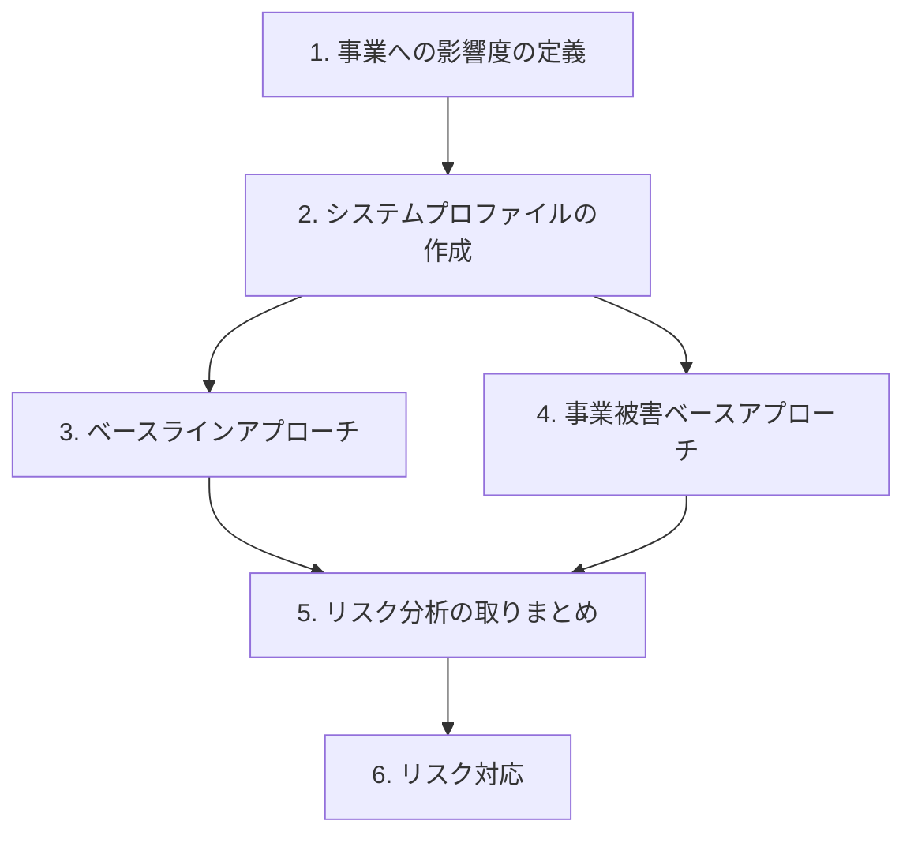
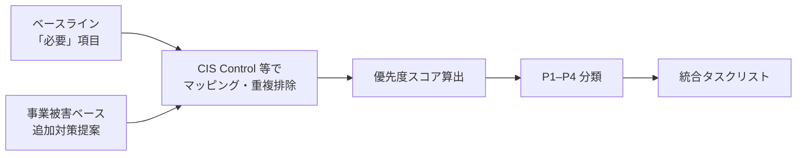

## tl;dr

- 小規模チーム向けの現実解は、CIS Controls 等のベースラインと事業被害ベースの攻撃シナリオを組み合わせる二軸分析
- 6段階（影響度定義 → プロファイル → 二軸分析 → 統合 → 対応）を回すと、対策タスクに P1–P4 まで付けられる
- 分析で終わらせない。リスクレジスタに P1 の担当と期限を1件入れた瞬間から運用フェーズ

## はじめに — なぜ手順だけを書いたか

セキュリティリスク分析は大企業や行政の話に聞こえがちです。専任担当がいない小規模チームでも、手順を固定しておけば対策の優先順位を説明できます。

私たちは B2B SaaS（クラウドバックエンド・Webフロント・現場端末・外部 SaaS 連携）向けに、政府系ガイドラインを参考にリスク分析を実施しました。攻撃シナリオ表は100件超、対策タスクも100件超に膨らみ、ベースライン適合率は3割台でした。表は揃ったのに、P1 の担当と期限が空のまま動かない——この状態が続いたので、プロセスだけを抽象化して残すことにしました。

:::details 固有名詞の抽象化対応表
| 具体表現 | 本記事での抽象表現 |
| --- | --- |
| 遠隔接客 SaaS | B2B SaaS / リアルタイム協業プラットフォーム |
| 特定クラウド（LB, コンテナ, DB 等） | クラウド基盤 / マネージドクラウド |
| 店舗設置 PC / 組込 OS | エッジ端末 / 現場端末 |
| リアルタイム通信 SaaS | 外部 SaaS（通信系） |
| 認証・通知 SaaS | 外部 SaaS（認証・データ系） |
| バックエンド API 群 | マイクロサービス / API サービス |
| CI 上の Code Scan | SAST パイプライン |
:::

こんな人向けです。

- エンジニアリングチームでリスク整理を始めたい
- ペンテスト前に「何を守るべきか」を言語化したい
- 対策タスクの優先順位づけに困っている

:::message
フレームワーク名（CIS Controls 等）やガイドラインへのリンクは、再現性のためにそのまま残しています。
:::

## 二軸にする — ベースラインで網羅し、事業被害で穴を埋める

リスク分析の手法は大きく3つに分かれます。

| 手法 | 長所 | 短所 |
| --- | --- | --- |
| ベースラインアプローチ | 既存基準に沿ったチェックで工数が抑えられる | 自社固有の事業被害まで踏み込みにくい |
| 事業被害ベースアプローチ | 実際の被害シナリオから逆算できる | 攻撃ツリーを網羅すると工数が爆発する |
| 詳細リスク分析（資産ベース等） | 精度が高い | 初回コストが大きく、専門家が必要 |

小規模チームなら、ベースラインを軸に、事業被害ベースで穴を埋めるのが現実的です。政府系ガイドラインでも同じ構成が推奨されています。

- 想定される脅威と対策を一通り把握できる
- 技術・事業・評価の3視点で相互確認できる
- 限られた人員でも完走できる

:::message alert
事業被害ベースでは「すべての攻撃ツリーを洗い出す」のではなく、トップリスク（最も避けたい事業被害）だけを見ます。ここを外すと、分析が終わりません。
:::

## 6段階で、表から P1 タスクまで降ろす



| ステップ | 成果物 | 主担当 |
| --- | --- | --- |
| 1 | 事業リスク×影響度の定義表 | ビジネス / リスクオーナー |
| 2 | システムプロファイル | システム管理者 |
| 3 | ベースライン適合状況表 | セキュリティ評価者 |
| 4 | 攻撃シナリオ表・対策タスクリスト | 評価者＋システム管理者 |
| 5 | 統合タスクリスト（優先度付き） | 全関係者でレビュー |
| 6 | リスクレジスタ・実施計画 | リスクオーナー |

評価者は1人でも回りますが、2人以上いると判定の偏りを抑えやすいです。

### まず1時間版（6ステップ全部は後回しでよい）

1. Step 1 — 事業リスク5類型×影響度を1時間で埋める
2. Step 2 — 認証モデルとアーキテクチャ図を1ページにまとめる
3. Step 3 — CIS Controls の Control 5–7（アカウント・脆弱性）だけ先に評価
4. Step 4 — クラウド基盤レイヤーだけ攻撃シナリオを10件書く
5. Step 5 — 上記から P1 を5件に絞る
6. Step 6 — P1 の1件目に担当と期限を入れる

分析表の完成度より、P1 に担当と期限が入ったかどうかでチームの動き方が変わります。

---

## Step 1: 事業への影響度を先に決める

後続のすべての工程で使う共通基準を、最初に決めます。

### 5類型の事業リスク（ガイドライン要約）

| # | 事業リスクの種類 |
| --- | --- |
| 1 | 利用者への不便・苦痛、または組織の信頼失墜 |
| 2 | 金銭的被害・賠償責任など財務上の影響 |
| 3 | 組織活動や公共の利益への影響 |
| 4 | 個人情報など機微情報の漏洩 |
| 5 | 法令違反 |

### 影響度

| 影響度 | イメージ |
| --- | --- |
| 高位 | 致命的・壊滅的。元の状態に戻せない |
| 中位 | 重大だが、復旧可能 |
| 低位 | 限定的・短期間 |
| 非該当 | 影響なし |

- 「個人情報漏洩＝必ず高位」と決め打ちしない。自社のデータ分類とサービス特性で判断する
- 各リスク類型について「最悪の事象」を1文で書いておくと、Step 4 が楽になる
- 四半期〜年次で見直す

---

## Step 2: システムプロファイルで前提を固定する

システムプロファイルは、リスク分析の根拠となる前提を文章化したものです。設計書の写しではなく、「なぜこの保証レベルなのか」を説明する資料です。

**事業の概要:** 事業目的 / 5類型の影響度 / 導出した保証レベル

**システムの意図する使用:** 誰が・どこから・どのネットワーク経路でアクセスするか

**システムの特性:** 情報資産 / 認証・認可モデル / アーキテクチャ / 主要なデータフロー（任意）

### 認証強度の目標（AAL の例）

NIST SP 800-63B の Authenticator Assurance Level（AAL）を参考にする例:

| レベル | 要件のイメージ |
| --- | --- |
| AAL1 | 単要素認証 |
| AAL2 | 多要素認証（ソフトウェアベース可） |
| AAL3 | 多要素認証＋ハードウェアトークン等 |

「目標の AAL」と「現状の AAL」の両方を書いておくと、ギャップが対策タスクに直結します。プロファイル作成自体が目的ではありません。分析の前提を固定するために書きます。

---

## Step 3: ベースラインで横断チェックする

既知のセキュリティ管理策フレームワークに沿って、不足している対策を洗い出します。

| 候補 | 向いているケース |
| --- | --- |
| CIS Controls | インフラ〜アプリまで横断的にチェックしたい |
| OWASP ASVS | アプリケーション中心。ただし抽象度が高く判定が難しい場合あり |
| クラウドベンダーの Well-Architected（Security Pillar） | 特定クラウドに依存する場合 |

本記事の例では CIS Controls v8 を採用し、Step 2 で導出した保証レベルに応じて Implementation Group（IG1 / IG2 / IG3）のスコープを切ります（例: AAL2 → IG2 まで、IG3 は非該当）。

### 「対策済」判定には根拠を必須にする

| 列 | 内容 |
| --- | --- |
| 管理策 ID / 名称 | CIS Control 番号等 |
| 要否判定 | 対策済 / 必要 / 不要 / 非該当 / 保留 / 対応中 |
| 判定理由 | 具体的な根拠（「対策済」は必須） |
| 不要時のリスク | 未対応の場合に起きうること |

ベースラインは「一般的に必要な対策」の網羅に向いています。自社固有の業務フロー上のリスクは拾いにくく、ポリシーはあるのに徹底されていない、といった理由で「対策済」判定が実態とズレやすくなります。この穴を Step 4 で埋めます。

---

## Step 4: 事業被害ベースで自社固有リスクを洗う

Step 1 で定義した事業被害を起点に、攻撃シナリオ → 攻撃ステップ → リスク値 → 対策、の順でたどります。ここが記事の核です。

### レイヤーごとに攻撃面を分ける

| レイヤー | 抽象化した例 | 主な侵入口 |
| --- | --- | --- |
| クラウド基盤 | LB / WAF / コンテナ / DB / オブジェクトストレージ | 設定ミス、認証情報漏洩、権限昇格 |
| エッジ端末 | 現場 PC / 組込 OS / キオスク端末 | 物理アクセス、USB、設定ファイル |
| 外部 SaaS | 認証基盤 / リアルタイム通信 / CI/CD | API キー、OAuth 設定、Secrets |

### 攻撃シナリオ表の列

| 列 | 説明 |
| --- | --- |
| 事業被害カテゴリ | Step 1 の類型に紐づける |
| 攻撃シナリオ | 1文で「何が起きるか」 |
| 攻撃ステップ | ツリーまたは段階分解 |
| 脅威レベル（1–3） | 起きやすさ |
| 脆弱性レベル（1–3） | 成功しやすさ |
| 事業被害レベル | 高位 / 中位 / 低位 |
| リスク値 | 算定式に基づく |
| 既存対策 | 侵入 / 拡散 / 目的遂行 / 検知 / 事業継続 |
| ベースライン管理策 No. | Step 3 との紐付け |
| 追加対策提案 | タスク化の種 |

### リスク値と優先検討ライン

```
リスク値 = 脅威レベル × 脆弱性レベル × 事業被害レベル（高位=3, 中位=2, 低位=1）
```

結果を A(9) / A(6) / B(2) 等の帯域にマッピングし、A(9) 以上を優先検討とする運用ルールを決めておきます。

具体例: 「ECS タスク定義の環境変数に DB 認証情報が平文」→ 脅威3 × 脆弱性3 × 被害高位3 = A(9) → 多要素認証や Secrets Manager 移行が P1 候補に上がる、といった流れです。

工数を爆発させないコツは4つだけです。全攻撃ツリーは書かない。侵入口の粒度を揃える。既存対策列を正直に埋める（「管理策なし」を恐れない）。Step 3 の「必要」項目と必ず紐付ける。

---

## Step 5: スコアで P1–P4 に分類し、リスクレジスタへ

Step 3 と Step 4 の結果を統合し、実行可能な対策タスクリストに落とします。



```
優先度スコア = リスク値スコア × 効果スコア ÷ 実装難易度スコア
```

| 優先度 | スコア目安 | 実施期間の目安 |
| --- | --- | --- |
| P1 | 9 以上 | 1–3 ヶ月 |
| P2 | 6–8 | 3–6 ヶ月 |
| P3 | 3–5 | 6–12 ヶ月 |
| P4 | 2 以下 | 12 ヶ月以上 |

| 対策 | リスク | 効果 | 難易度 | スコア | 分類 |
| --- | --- | --- | --- | --- | --- |
| 多要素認証の導入 | 9 | 3（複数脅威） | 2（中） | 13.5 | P1 |
| シークレット管理の強化 | 6 | 2（単一） | 2（中） | 6.0 | P2 |
| ログのマスキング | 3 | 1（限定的） | 1（低） | 3.0 | P3 |

### リスクレジスタが分析と運用の境界

| 列 | 例 |
| --- | --- |
| リスク ID | RISK-001 |
| 名称 | デプロイパイプライン経由の改ざん |
| 由来 | ベースライン / 事業被害 |
| 優先度 | P1 |
| 対応方針 | 対策実施 / 要監視 / 許容 |
| 担当 | （記入） |
| 期限 | （記入） |

:::message
分析ドキュメントが完成しても、リスクレジスタが空のままでは Step 6 に進めません。P1 タスクから担当と期限を埋めるのが最初の一歩です。
:::

---

## Step 6: P1 から動かし、四半期で見直す

P1 から着手します。認証強化、Secrets 管理、端末暗号化など、複数シナリオに効く対策が典型です。P2 は四半期計画に載せ、P3 / P4 はバックログに入れます。「許容」にした項目も、四半期ごとに見直してください。

ベースラインの Control 16（アプリケーションセキュリティ）には、CI 上の静的解析（SAST）パイプラインを接続できます。SARIF を共通形式にすると、複数ツールの結果を Slack 等に集約しやすくなります。Step 4 の「アプリケーション脆弱性」シナリオを継続的に検知する手段として、CI パイプラインに組み込みましょう。

:::details SAST パイプラインの例とツール選定
| レイヤー | ツール例 | 出力 |
| --- | --- | --- |
| 多言語共通 | パターンベース SAST | SARIF |
| 言語特化 | 各言語向け SAST | SARIF |
| レビュー補助 | LLM によるセキュアコーディングレビュー | SARIF |

選定時の観点: プライベートリポジトリで無料枠内か / SARIF 等の標準出力があるか / 言語カバレッジ / CI 実行時間（`continue-on-error` で検出とビルド失敗を分離する等）
:::

| トリガー | 見直し内容 |
| --- | --- |
| 定期（四半期〜年次） | 優先度・実装率 |
| アーキテクチャ変更 | 攻撃面の追加・削除 |
| インシデント | 該当シナリオの再評価 |
| 法規制・脅威環境の変化 | 事業リスク定義の更新 |

---

## 回してみて止まりやすかった5つの穴

| 問題 | 対処 |
| --- | --- |
| 目標 AAL と現状 AAL のギャップがタスクに分散 | プロファイルに「認証ギャップ一覧」を明示する |
| 「対策済」判定が楽観的 | 判定理由を必須化し、証跡リンクを求める |
| 100件超のタスクリストが動かない | リスクレジスタで P1 だけ担当・期限を先に埋める |
| 事業被害ベースが肥大化 | トップリスクに限定するルールを最初に決める |
| 分析が「ドキュメント作成」で終わる | Step 6 の KPI（P1 完了率）を置く |

二軸にした効果は大きかったです。「一般的な不足」と「自社固有リスク」の両方を説明できるようになりました。レイヤー分割も、レビュー担当者の分担に効きました。優先度スコアは「なぜ P1 か」の会話を助け、ベースラインと CI の SAST を Control 番号で接続できた点も収穫でした。

---

## 参考資料

- [デジタル庁: 政府システムにおけるセキュリティ分析ガイドライン（PDF）](https://www.digital.go.jp/assets/contents/node/basic_page/field_ref_resources/e2a06143-ed29-4f1d-9c31-0f06fca67afc/1b65a1dc/20230411_resources_standard_guidelines_guideline_01.pdf)
- [IPA: 制御システムのセキュリティリスク分析ガイド](https://www.ipa.go.jp/security/control/system/ssf7ph00000098vy-att/000109380.pdf)
- [CIS Controls v8](https://www.cisecurity.org/controls/v8)
- [NIST SP 800-63B（AAL）日本語訳](https://openid-foundation-japan.github.io/800-63-3-final/sp800-63b.ja.html)
